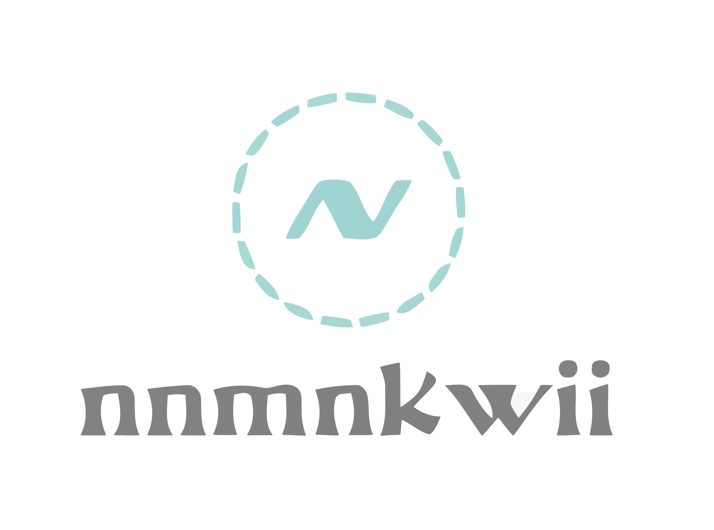

# nnmnkwii ([nanamin kawaii])
[![][docs-stable-img]][docs-stable-url]
[![][docs-latest-img]][docs-latest-url]

Library to build speech synthesis systems designed for easy and fast prototyping.

Supported python versions: 2.7 and 3.6.

## Documentation

- [**STABLE**][docs-stable-url] &mdash; **most recently tagged version of the documentation.**
- [**LATEST**][docs-latest-url] &mdash; *in-development version of the documentation.*

## Installation

The latest release is availabe on pypi. Assuming you have already ``numpy`` installed, you can install nnmnkwii by:

    pip install nnmnkwii

If you want the latest development version, run:

    pip install git+https://github.com/r9y9/nnmnkwii

or:

    git clone https://github.com/r9y9/nnmnkwii
    cd nnmnkwii
    python setup.py develop # or install

This should resolve the package dependencies and install ``nnmnkwii`` property.

At the moment, `nnmnkwii.autograd` package depends on [PyTorch](http://pytorch.org/).
If you need autograd features, please install PyTorch as well.

## Acknowledgements

The library is inspired by the following open source projects:

- Merlin: https://github.com/CSTR-Edinburgh/merlin
- Librosa: https://github.com/librosa/librosa

[docs-latest-img]: https://img.shields.io/badge/docs-latest-blue.svg
[docs-latest-url]: https://r9y9.github.io/nnmnkwii/latest

[docs-stable-img]: https://img.shields.io/badge/docs-stable-blue.svg
[docs-stable-url]: https://r9y9.github.io/nnmnkwii/stable

Logo was created by Gloomy Ghost([@740291272](https://github.com/740291272)) ([#40](https://github.com/r9y9/nnmnkwii/issues/40))
